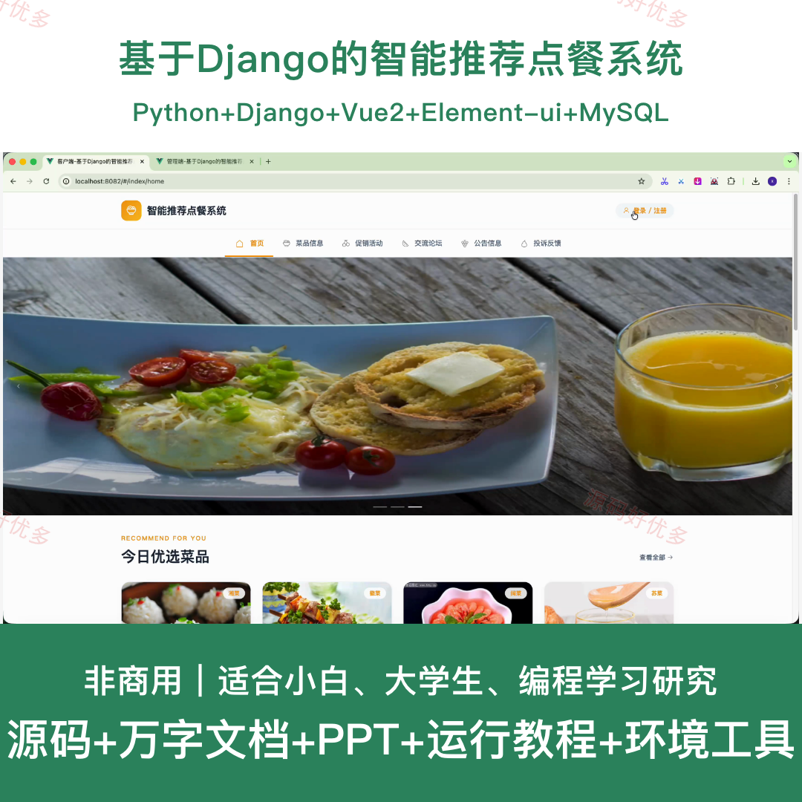
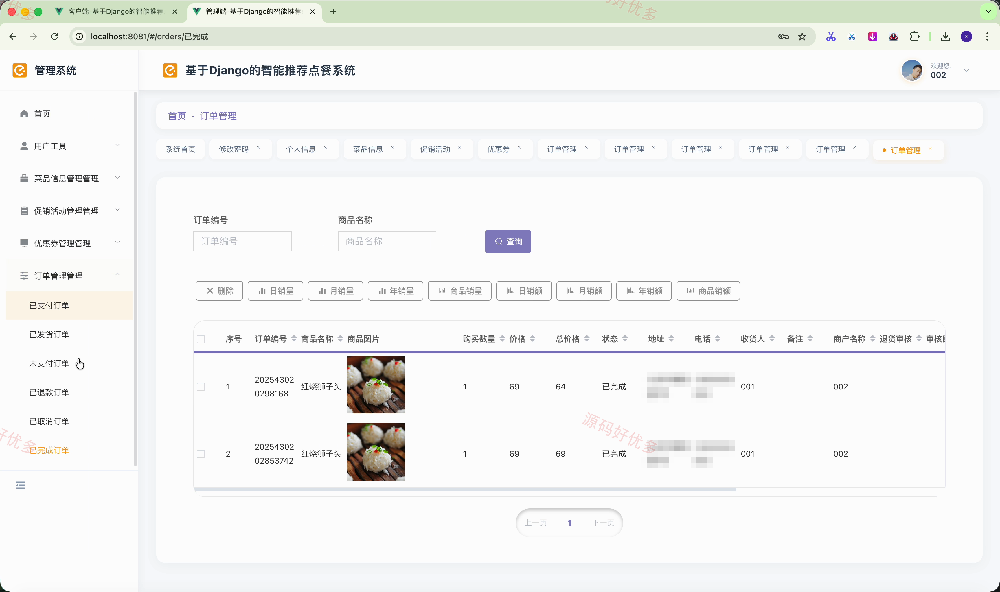
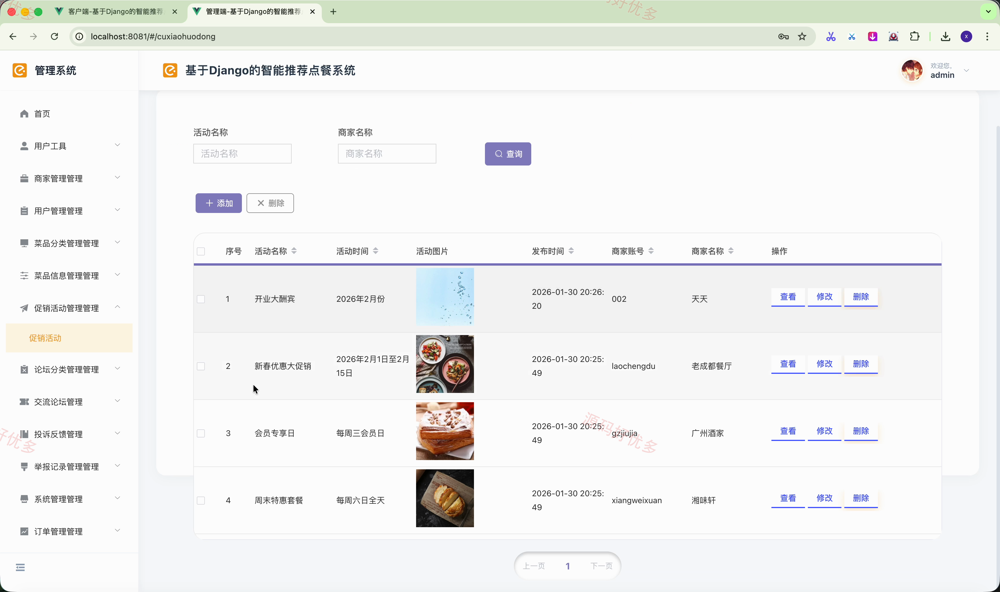
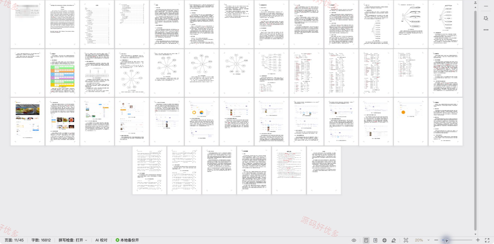

## 源码问题查看主页咨询

### 一、关键词
智能推荐、在线点餐、菜品管理、优惠促销、购物车、订单管理

### 二、作品包含
源码+数据库+万字设计文档+PPT+全套环境和工具资源+本地部署教程

### 三、项目技术
前端技术： Html、Css、Js、Vue2.6、Element-ui
后端技术：Python、Django

### 四、运行环境（以下版本亲测，其他版本兼容性请自行测试）
开发工具：PyCharm + VSCODE

数据库：MySQL5.7+（共24张表）

数据库管理工具：Navicat10以上版本

环境配置软件： Python3+

前端Nodejs：14+

浏览器：谷歌浏览器

### 五、项目介绍
项目编号：python140D

本系统面向线上智能点餐场景，为用户提供菜品浏览、收藏评价、购物车、在线下单与订单跟踪服务；商家可维护菜品、促销活动、优惠券并处理订单，管理员负责商家、用户、论坛反馈和运营数据管理。

角色：管理员、商家、用户

管理员功能：商家审核与管理、用户管理与统计、菜品分类管理、菜品信息与评论统计、促销活动管理、论坛反馈与举报管理、公告轮播与智能客服管理、订单与销售统计管理。

商家功能：后台登录与注册、菜品信息管理与统计、促销活动管理、优惠券管理、订单状态管理、订单发货物流与退货审核。

用户功能：前台登录与注册、菜品与促销活动浏览、菜品收藏评论与商家私聊、购物车管理、点餐下单与支付、订单查询退货与确认收货、论坛交流与投诉反馈、账户充值与个人中心。

### 六、运行截图

